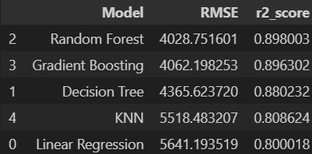
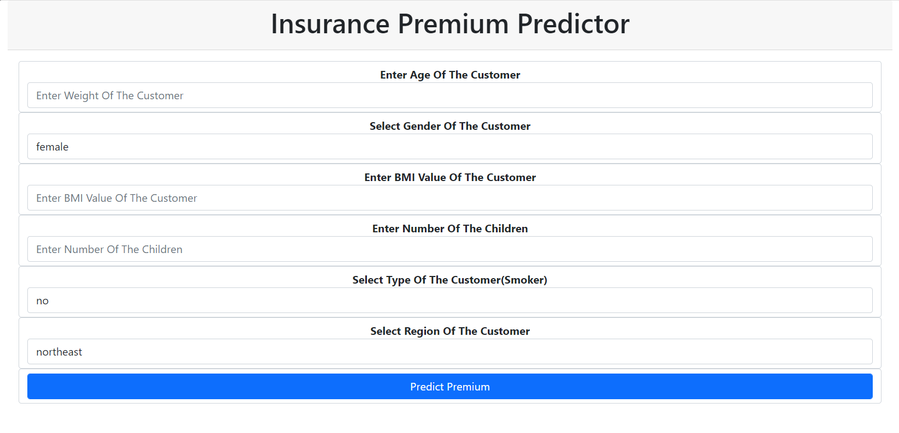

# Insurance Premium Prediction 🔮💰

## Project Overview: 🚀

The project focuses on predicting insurance premiums using machine learning algorithms. It involves analyzing various factors such as age, medical history, lifestyle, and coverage details to estimate the cost of insurance for individuals or groups. The goal is to develop accurate predictive models that can assist insurance companies in pricing their policies effectively.

## Real-Time Usage Contrast: ⏱️

In real-time usage, insurance premium prediction models are deployed within insurance companies' systems. When customers apply for insurance coverage, these models are used to calculate the premium based on the provided information. The prediction is instantaneous, allowing insurers to offer quotes quickly and accurately.

## Dataset Description: 📊

- **age**: Age of the person 👴👵
- **sex**: Gender of the person 👨👩
- **bmi**: Body Mass Index of the person 🏋️‍♀️
- **children**: Number of children 👶
- **region**: Region/location 🌍
- **expenses**: Monthly expenses of the person 💰

## Project Flow: 🧭

- **Importing Libraries**: Import necessary libraries for our project according to criteria. 📚
- **Data Visualization**: By transforming raw data into visual representations, data visualization enables users to easily interpret and understand trends, patterns, and relationships within the data. You can find all the visualizations in the `code.ipynb` file. 📈
- **Data Segregation** 🔀
- **Data Pipeline**: Implemented two separate pipelines to preprocess numerical and categorical columns: one for scaling numerical data and another for converting categorical classes to binary using the `OneHotEncoder()` method. Combined these pipelines into a column transformer to efficiently preprocess the entire dataset. ⚙️

## Algorithms: 🧠

- **Linear Regression**: A linear model that predicts continuous target variables based on the linear relationship between input features and target values. 📐
- **KNN Regression**: A non-parametric algorithm that predicts the target variable by averaging the values of its k-nearest neighbors in the feature space. 🔍
- **Decision Tree Regression**: A regression algorithm that uses a tree-like model to predict the target variable by recursively partitioning the feature space into regions and assigning each region a predicted value. 🌳
- **Gradient Boosting Regression**: An ensemble learning technique that builds a series of decision trees sequentially, with each tree correcting the errors of the previous one, to predict the target variable. 🚀
- **Random Forest Regression**: An ensemble learning method that trains multiple decision trees on random subsets of the training data and averages their predictions to improve accuracy and reduce overfitting in regression tasks. 🌲

## Results: 📊

## Model Deployment: 🚀

The model was deployed using Pickle for serialization, integrated into a Flask application, and complemented with a user interface developed using HTML and CSS for seamless interaction. 💻

## Applications: 🌟

1. **Personalized Insurance Quotes**: Using predictive modeling, insurance companies can offer personalized quotes to customers based on their individual risk profiles. This improves customer satisfaction and enhances the competitiveness of insurance providers. 🤝

2. **Risk Assessment and Underwriting**: Predictive models can assess the risk associated with insuring a particular individual or property, allowing insurance companies to make more informed underwriting decisions. This helps mitigate losses and optimize pricing strategies. 🔍

3. **Fraud Detection**: Predictive analytics can be employed to identify suspicious patterns and anomalies in insurance claims data, enabling early detection of fraudulent activities. This helps reduce financial losses due to fraudulent claims and protects the interests of genuine policyholders. 🚨

4. **Portfolio Management and Risk Hedging**: Insurance companies can use predictive analytics to optimize their portfolio management strategies and hedge against potential risks. This involves diversifying risks across different insurance products and investment vehicles to achieve optimal returns while minimizing exposure to catastrophic events. 📈

## How to Run the App: 🏃‍♂️

You can run the app by executing the `app.py` code present in the repository. 🚀
